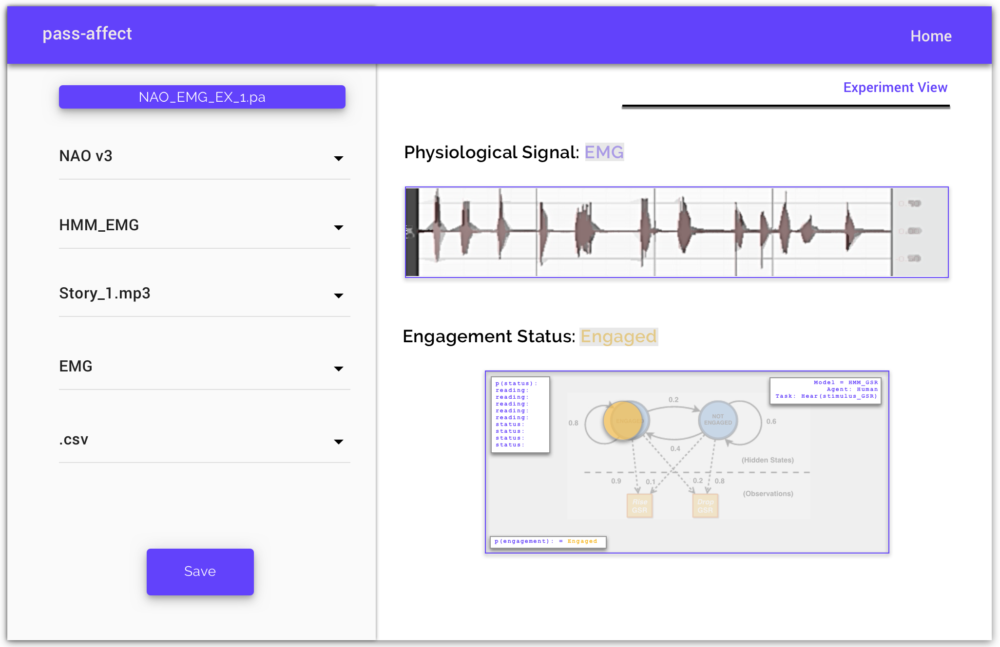

# pass-affect
Library to help model affect passing during Human-Robot-Interactions

---
**CHI2021 Guidelines:**
* [Online Submission:]() Made to [Precision Conference]()
* [Submission format:]() anonymized, no page limit, but the longer the paper, the greater the required contribution, a maximum 150-word abstract, based on the appropriate template.
* [Anonymization:]() Please ensure that your submission conforms to the Anonymization Policy. Consistent with CHI 2020, papers that violate the anonymization rule will be desk-rejected, so please carefully check your paper and supplementary material on PCS before final submission.

**CHI2021 Project Submissions:**
1. [pass-affect-0: Analyzing the Effect of Gesturing on Comprehension and Retention During Human-Robot-Interaction]() 

2. [pass-affect-1: Open Framework for Modeling Affect Passing During Human-Robot-Interaction]()
